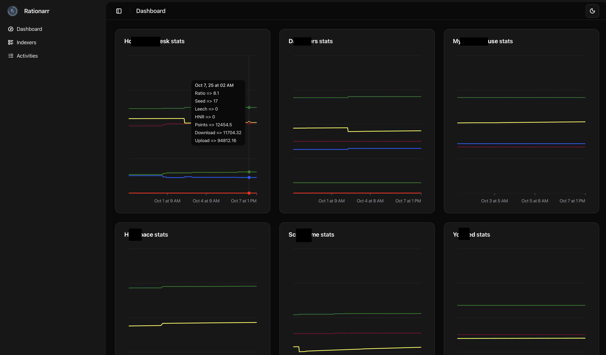
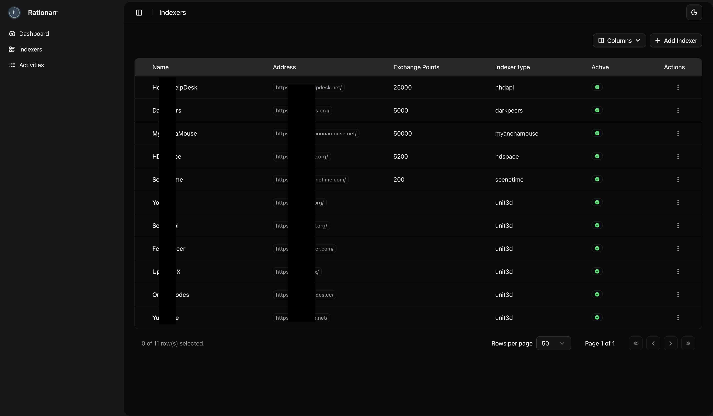

<!-- # Rationarr  -->

<div id="toc">
  <ul align="center" style="list-style: none">
    <summary>
      <h1>
        
        Rationarr
      </h1>
      <p align="center">
        
        <a href="https://github.com/peterbuga/rationarr/actions"></a>
        <a href="https://github.com/peterbuga/rationarr/actions"></a>
        <a href="https://github.com/peterbuga/rationarr/blob/master/LICENSE"></a>
        </p>
    </summary>
  </ul>
  <ul align="center" style="list-style: none">
    <summary>
      <h3>
        Watch your favorite indexers stats over time and automate ratio-improvement tasks.
      </h3>
    </summary>
  </ul>
</div>

> [!WARNING]
> ⚠️ This is very much still work in progress! There are no safety measures in place, DO NOT expose the app to the internet, place it behind IAM apps like Authelia/Authentik/KeyCloak etc or limit strictly to internal/vpn network use!
> 

## 📝 Table of Contents

1. [Preview](#preview)
2. [Description](#description)
3. [Indexers](#indexers)
4. [Getting started](#installation)
5. [Development](#development)
6. [License](#license)


## <a name="preview"></a> 🖼️ Preview




## <a name="description"></a> 🙄 Yet another *arr ...
Initially this was supposed to be a collection of scripts but eventually evolved into **Rationarr**.

This was created in mind to complement [Prowlarr](https://github.com/Prowlarr/Prowlarr) and maximize indexers' usage based on various criterias:
* stop indexers usage when a specific ratio threshold was reached to avoid warnings [*not implemented yet*]
* trigger notifications if seed items dropped drastically below a specific threshold (ex: client/seedbox stopped or suddently not-connectable anymore from indexer side) [*not implemented yet*]
* auto use bonuses (*where it applies) to increase the ratio
* nice graphs to see basic indexer stats over time
* *other nice features I haven't thought so far ...*

## <a name="indexers"></a> 🗃️ Indexers

Support for indexers is basic so far due to PoC-level, more to come:

* MAM
* HDS
* HHD
* ST
* DP
* *generic UNIT3D-based indexer*

## <a name="installation"></a> 🖥️ Getting started

### Requirements
* docker
* a running and accessible [Prowlarr](https://prowlarr.com) instance
* (optional) [FlareSolverr](https://github.com/FlareSolverr/FlareSolverr) instance (not included by default in base `compose.yml`)

Copy `.env.template` to `.env`, fill up the required envs and run:

```bash
docker compose up -d
```

As a minimum security the app runs as non-root user `1000:1000`.

## <a name="development"></a> 🪚 Development

### Frontend

The `rationarr-web` container takes care of installing npm modules and properly starting the app.

`npm run fix-format` for linting

### Backend

The `rationarr-app` container takes care of installing pip modules (by building the docker image) and properly starting the app.

#### Run migrations

```bash
alembic upgrade head
```

### Create db migration

```bash
alembic revision --autogenerate -m 'Migration message'
```

###  Run development locally

The following command create a separate container for the following:
* rationarr-app - backend API based on FastAPI available on port `:8000`
* rationarr-web - frontend NextJS available on port `:5173`
* rationarr-db - postgres17
* rationarr-traefik - reverse proxy for backend+frontend to route traffic on backend+frontend on port `:8009` - prefferably to use this for dev
* rationarr-prowlarr
* rationarr-flaresolverr

```bash
docker compose -f compose.yml -f compose.dev.yml up -d
```

## <a name="license"></a> 📜 License

This project is licensed under the AGPL v3.0 License. See the [LICENSE](https://github.com/HDInnovations/UNIT3D-Community-Edition/blob/master/LICENSE.md) file for details.
